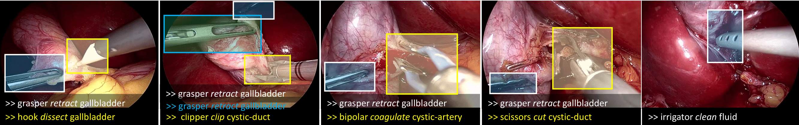
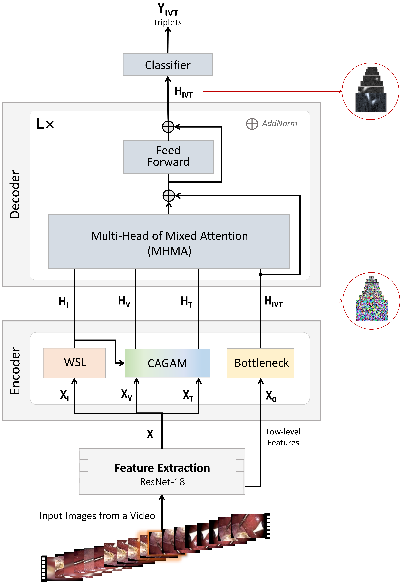
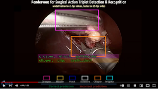
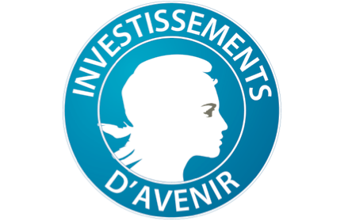
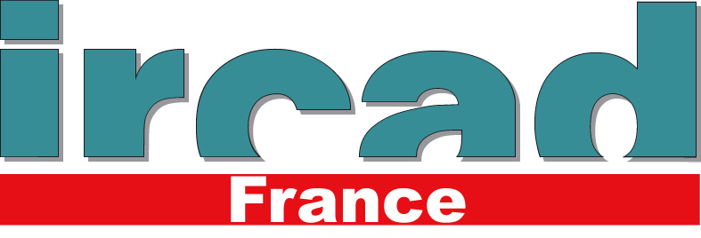
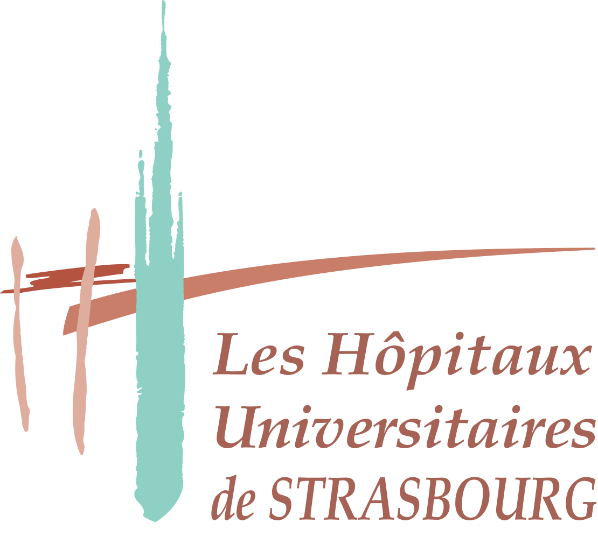
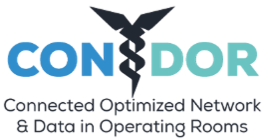

<div align="center">
<a href="http://camma.u-strasbg.fr/">

</a>
</div>
<br/>


[](https://hamzamohdzubair.github.io/redant/)


# **Rendezvous**: Attention Mechanisms for the Recognition of Surgical Action Triplets in Endoscopic Videos

<i>C.I. Nwoye, T. Yu, C. Gonzalez, B. Seeliger, P. Mascagni, D. Mutter, J. Marescaux, and N. Padoy</i>



This repository contains the implementation code, inference demo, and evaluation scripts.
<br />
[](https://arxiv.org/abs/2109.03223) 
[](https://doi.org/10.1016/j.media.2022.102433)
[](https://paperswithcode.com/sota/action-triplet-recognition-on-cholect50?p=rendezvous-attention-mechanisms-for-the)
<!-- [](https://colab.research.google.com/github/CAMMA-public/ConvLSTM-Surgical-Tool-Tracker/blob/master/evaluation.ipynb) -->


# Abstract
Out of all existing frameworks for surgical workflow analysis in endoscopic videos, action triplet recognition stands out as the only one aiming to provide truly fine-grained and comprehensive information on surgical activities. 
This information, presented as <instrument, verb, target> combinations, is highly challenging to be accurately identified. 
Triplet components can be difficult to recognize individually; in this task, it requires not only performing recognition simultaneously for all three triplet components, but also correctly establishing the data association between them.
To achieve this task, we introduce our new model, the <i> Rendezvous</i> (RDV), which recognizes triplets directly from surgical videos by leveraging attention at two different levels.
We first introduce a new form of spatial attention to capture individual action triplet components in a scene; called <i> Class Activation Guided Attention Mechanism</i> (CAGAM). 
This technique focuses on the recognition of verbs and targets using activations resulting from instruments.
To solve the association problem, our RDV model adds a new form of semantic attention inspired by Transformer networks; <i> Multi-Head of Mixed Attention</i> (MHMA). 
This technique uses several cross and self attentions to effectively capture relationships between instruments, verbs, and targets.
We also introduce <i> CholecT50</i>  - a dataset of 50 endoscopic videos in which <i>every</i> frame has been annotated with labels from 100 triplet classes.
Our proposed RDV model significantly improves the triplet prediction mAP by over 9% compared to the state-of-the-art methods on this dataset.

<br>

------
# News and Updates
- <b>[2022.04.01]:</b> Demo code and pre-trained model released!
- <b>[2022.04.12]:</b> 45 videos subset of CholecT50 released! [download access](http://camma.u-strasbg.fr/datasets).
<!-- - <b>[2022.03.22]:</b> The paper is accepted at Elsevier Medical Image Analysis 2022! -->

<br>


------
# Model Overview


The RDV model is composed of:
* Feature Extraction layer: extract high and low level features from input image from a video
* Encoder: for triplet components encoding
    * Weakly-Supervised Localization (WSL) Layer: for localizing the instruments
    * Class Activation Guided Attention Mechanism (CAGAM): for detecting the verbs and targets leveraging attention resulting from instrument activations. (channel anad position spatial attentions are used here)
    * Bottleneck layer: for collecting unfiltered features for initial scene understanding
* Decoder: for triplet assocaition decoding over L successive layers
    * Multi-Head of Mixed Attention (MHMA): for learning to associate instrument-verb-target using successive self- and cross-attention mechanism
    * Feed-forward layer: for triplet feature refinement
* Classifier: for final triplet classification


We hope this repo will help researches/engineers in the development of surgical action recognition systems. For algorithm development, we provide training data, baseline models and evaluation methods to make a level playground. For application usage, we also provide a small video demo that takes raw videos as input without any bells and whistles.

<br>

------
# Performance
## Results Table


||Components AP ||||| Association AP |||
:---:|:---:|:---:|:---: |:---:|:---:|:---:|:---:|:---:|
AP<sub>I</sub> | AP<sub>V</sub> | AP<sub>T</sub> ||| AP<sub>IV</sub> | AP<sub>IT</sub> | AP<sub>IVT</sub> |
92.0 | 60.7 | 38.3 ||| 39.4 | 36.9 | 29.9|

<br />

## Video Demo


<a href="https://www.youtube.com/watch?v=d_yHdJtCa98&t=61s"></a>

Youtube [link](https://www.youtube.com/watch?v=d_yHdJtCa98&t=61s) for full video
<br>

------
# Installation
## Requirements
The model depends on the following libraries:
1. sklearn
2. PIL
3. Python >= 3.5
4. t50metrics ( ``` pip install t50metrics ``` )
5. Developer's framework:
    1. For Tensorflow version 1:
        * TF >= 1.9

    2. For Tensorflow version 2:
        * TF >= 2.1
    3. For PyTorch version:
        - Pyorch >= 1.10.1
        - TorchVision >= 0.11


## Quick Start

## Docker Example

## System Requirements:
The code has been test on Linux operating system. It runs on both CPU and GPU.
Equivalence of basic OS commands such as _unzip, cd, wget_, etc. will be needed to run in Windows or Mac OS.

## Downloads

<br>

------

# Dataset Zoo

[CholecT45](https://github.com/CAMMA-public/cholect45) and CholecT50

## Data splits
[](https://arxiv.org/abs/2204.05235)

## Data Preparation

<br>

------
# Model Zoo

* **N.B.** Download links to models' weights will not be provided until after the CholecTriplet2022 challenge.

## TensorFlow v1
| Network   | Base      | Resolution | Dataset   | Data split    | AP<sub>IVT</sub> | Link             |
------------|-----------|------------|-----------|---------------|------------------|------------------|
| Rendezvous| ResNet-18 | High       | CholecT50 | RDV           | | [Google] [Baidu] |
| Rendezvous| ResNet-18 | High       | CholecT45 | CholecTriplet | | [Google] [Baidu] |

<br />


## PyTorch
| Network   | Base      | Resolution | Dataset   | Data split    | AP<sub>IVT</sub> | Link             |
------------|-----------|------------|-----------|---------------|------------------|------------------|
| Rendezvous| ResNet-18 | Low        | CholecT50 | RDV           |  | [Google] [Baidu] |
| Rendezvous| ResNet-18 | High       | CholecT50 | RDV           |  | [Google] [Baidu] |
| Rendezvous| ResNet-18 | Low        | CholecT45 | CholecTriplet |  | [Google] [Baidu] |
| Rendezvous| ResNet-18 | Low        | CholecT50 | CV-1          |  | [Google] [Baidu] |
| Rendezvous| ResNet-18 | Low        | CholecT50 | Cv-2          |  | [Google] [Baidu] |
| Rendezvous| ResNet-18 | Low        | CholecT50 | CV-3          |  | [Google] [Baidu] |
| Rendezvous| ResNet-18 | Low        | CholecT50 | Cv-4          |  | [Google] [Baidu] |
| Rendezvous| ResNet-18 | Low        | CholecT50 | CV-5          |  | [Google] [Baidu] |
| Rendezvous| ResNet-18 | Low        | CholecT45 | CV-1          |  | [Google] [Baidu] |
| Rendezvous| ResNet-18 | Low        | CholecT45 | Cv-2          |  | [Google] [Baidu] |
| Rendezvous| ResNet-18 | Low        | CholecT45 | CV-3          |  | [Google] [Baidu] |
| Rendezvous| ResNet-18 | Low        | CholecT45 | Cv-4          |  | [Google] [Baidu] |
| Rendezvous| ResNet-18 | Low        | CholecT45 | CV-5          |  | [Google] [Baidu] |
<br>


## TensorFlow v2
| Network   | Base      | Resolution | Dataset   | Data split    | AP<sub>IVT</sub> | Link             |
------------|-----------|------------|-----------|---------------|------------------|------------------|
| Rendezvous| ResNet-18 | High       | CholecT50 | RDV           |  | [Google] [Baidu] |
| Rendezvous| ResNet-18 | Low        | CholecT50 | RDV           |  | [Google] [Baidu] |
| Rendezvous| ResNet-18 | High       | CholecT45 | CholecTriplet |  | [Google] [Baidu] |

<br />


## Baseline Models
| Model | Layer Size | Ablation Component |AP<sub>IVT</sub> | Link |
------------|------|------------|------|-----|
|Rendezvous | 1 | Proposed |  | [Google] [Baidu] |
|Rendezvous | 2 | Proposed |  | [Google] [Baidu] |
|Rendezvous | 4 | Proposed |  | [Google] [Baidu] |
|Rendezvous | 8 | Proposed |29.9  | [Google] [Baidu] |
|Rendezvous | 8 | Patch sequence |  | [Google] [Baidu] |
|Rendezvous | 8 | Temporal sequence |  | [Google] [Baidu] |
|Rendezvous | 8 | Single Self Attention Head |  | [Google] [Baidu] |
|Rendezvous | 8 | Multiple Self Attention Head |  | [Google] [Baidu] |
|Rendezvous | 8 | CholecTriplet2021 Challenge Model | 32.7|   [Google] [Baidu] |


<br>

------
# Training
## Training on CholecT50 Dataset
Experimental setup is in the published paper.

## Training on Custom Dataset
Adding custom datasets is quite simple, all you need to do is to organize your annotation files in the same format as in our training sets. Model layers can be modified to class size of your task.

<br>

------
# Testing


## Inference

<br>

## Evaluation
### metrics: ivtmetrics
```
pip install ivtmetrics
```
or
```
conda install -c nwoye ivtmetrics
```
<br>


------
# License


This code, models, and datasets are available for **non-commercial scientific research purposes** provided by [CC BY-NC-SA 4.0 LICENSE](https://creativecommons.org/licenses/by-nc-sa/4.0/) attached as [LICENSE file](LICENSE). 
By downloading and using this code you agree to the terms in the [LICENSE](LICENSE). Third-party codes are subject to their respective licenses.

<!-- 
------
# Acknowledgment

This work was supported by French state funds managed within the Investissements d'Avenir program by BPI France in the scope of ANR project CONDOR, ANR Labex CAMI, ANR DeepSurg, ANR IHU Strasbourg and ANR National AI Chair AI4ORSafety.
We thank the research teams of IHU and IRCAD  for their help in the initial annotation of the dataset during the CONDOR project.

<br><br>
 


 
 

<br>
<br><br>
-->


------

# Related Resources
<b>
   
-  CholecT45 / CholecT50 Datasets
   [](http://camma.u-strasbg.fr/datasets) 
   [](https://github.com/CAMMA-public/cholect45)   
-  Offical Dataset Splits 
   [](https://arxiv.org/abs/2204.05235)
-  Tripnet 
   [](https://arxiv.org/abs/2007.05405) 
   [](https://github.com/CAMMA-public/tripnet)   
-  Attention Tripnet
   [](https://arxiv.org/abs/2109.03223) 
   [](https://github.com/CAMMA-public/attention-tripnet) 
-  CholecTriplet2021 Challenge
   [](https://cholectriplet2021.grand-challenge.org) 
   [](https://arxiv.org/abs/2204.04746) 
   [](https://github.com/CAMMA-public/cholectriplet2022) 
-  CholecTriplet2022 Challenge
   [](https://cholectriplet2022.grand-challenge.org) 
   [](https://github.com/CAMMA-public/cholectriplet2022)
 
</b>

<br>


------

# Citation
If you find this repo useful in your project or research, please consider citing the relevant publications:

- For the CholecT45/CholecT50 Dataset:
```
@article{nwoye2021rendezvous,
  title={Rendezvous: Attention Mechanisms for the Recognition of Surgical Action Triplets in Endoscopic Videos},
  author={Nwoye, Chinedu Innocent and Yu, Tong and Gonzalez, Cristians and Seeliger, Barbara and Mascagni, Pietro and Mutter, Didier and Marescaux, Jacques and Padoy, Nicolas},
  journal={Medical Image Analysis},
  volume={78},
  pages={102433},
  year={2022}
}
```


- For the CholecT45/CholecT50 Official Dataset Splits:
```
@article{nwoye2022data,
  title={Data Splits and Metrics for Benchmarking Methods on Surgical Action Triplet Datasets},
  author={Nwoye, Chinedu Innocent and Padoy, Nicolas},
  journal={arXiv preprint arXiv:2204.05235},
  year={2022}
}
```


- For the Rendezvous or Attention Tripnet Baseline Models or any snippet of code from this repo:
```
@article{nwoye2021rendezvous,
  title={Rendezvous: Attention Mechanisms for the Recognition of Surgical Action Triplets in Endoscopic Videos},
  author={Nwoye, Chinedu Innocent and Yu, Tong and Gonzalez, Cristians and Seeliger, Barbara and Mascagni, Pietro and Mutter, Didier and Marescaux, Jacques and Padoy, Nicolas},
  journal={Medical Image Analysis},
  volume={78},
  pages={102433},
  year={2022}
}
```

- For the Tripnet Baseline Model:
```
@inproceedings{nwoye2020recognition,
   title={Recognition of instrument-tissue interactions in endoscopic videos via action triplets},
   author={Nwoye, Chinedu Innocent and Gonzalez, Cristians and Yu, Tong and Mascagni, Pietro and Mutter, Didier and Marescaux, Jacques and Padoy, Nicolas},
   booktitle={International Conference on Medical Image Computing and Computer-Assisted Intervention (MICCAI)},
   pages={364--374},
   year={2020},
   organization={Springer}
}
```


- For the models presented @ CholecTriplet2021 Challenge:
```
@article{nwoye2022cholectriplet2021,
  title={CholecTriplet2021: a benchmark challenge for surgical action triplet recognition},
  author={Nwoye, Chinedu Innocent and Alapatt, Deepak and Vardazaryan, Armine ... Gonzalez, Cristians and Padoy, Nicolas},
  journal={arXiv preprint arXiv:2204.04746},
  year={2022}
}
```

#
<br>
This repo is maintained by CAMMA. Comments and update on models are welcomed. Check this page for updates.
